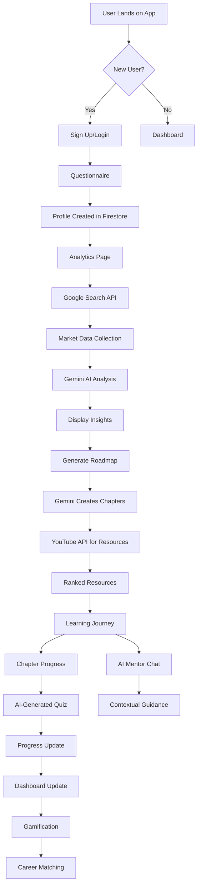

# 🚀 SkillGenie - Complete App Architecture Implementation

## ✅ Current Implementation Status

### Phase 1: Foundation (COMPLETED)
- ✅ Basic React app with routing
- ✅ Questionnaire component 
- ✅ Analytics page with charts
- ✅ Roadmap generation
- ✅ AI Mentor chat
- ✅ Backend API with Express
- ✅ Gemini AI integration

### Phase 2: Core Enhancements (IN PROGRESS)
- ✅ Clean Gemini service (cleanGeminiService.js)
- ✅ Firebase config (firebaseConfig.js)
- ✅ Auth service (authService.js)
- ✅ Login page component
- ✅ Firebase Admin service (firebaseAdmin.js)
- ✅ Google Search service (googleSearchService.js)
- ✅ Enhanced Gemini Analyst (enhancedGeminiAnalyst.js)
- ⏳ User profile management
- ⏳ Progress tracking
- ⏳ Quiz generation

## 📐 Complete App Flow Architecture



## 🏗️ System Components

### 1. Frontend (React)
```javascript
src/
├── pages/
│   ├── Login.js ✅
│   ├── Questionnaire.js ✅
│   ├── Dashboard.js ⏳
│   ├── AIAnalysis.js ✅
│   ├── Roadmap.js ✅
│   ├── AIMentor.js ✅
│   ├── QuizPage.js ⏳
│   └── CareerMatch.js ⏳
├── services/
│   ├── firebaseConfig.js ✅
│   ├── authService.js ✅
│   ├── questionnaireService.js ✅
│   ├── roadmapService.js ✅
│   └── gamificationService.js ⏳
└── components/
    ├── PrivateRoute.js ⏳
    ├── ProgressTracker.js ⏳
    ├── ChapterResources.js ⏳
    ├── QuizQuestion.js ⏳
    └── NotificationCenter.js ⏳
```

### 2. Backend (Node.js/Express)
```javascript
backend/
├── services/
│   ├── firebaseAdmin.js ✅
│   ├── cleanGeminiService.js ✅
│   ├── enhancedGeminiAnalyst.js ✅
│   ├── googleSearchService.js ✅
│   ├── youtubeService.js ✅
│   ├── quizGenerator.js ⏳
│   ├── jobMatcher.js ⏳
│   └── scheduledJobs.js ⏳
├── routes/
│   ├── auth.js ✅
│   ├── analytics.js ✅
│   ├── roadmaps.js ✅
│   ├── chat.js ✅
│   ├── quizzes.js ⏳
│   └── careers.js ⏳
└── middleware/
    ├── authentication.js ⏳
    └── validation.js ⏳
```

## 📊 Data Flow & AI Integration Points

### Stage 1: User Onboarding
```javascript
// Frontend
const handleSignUp = async (userData) => {
  const user = await authService.signUpWithEmail(email, password, name);
  navigate('/questionnaire');
};

// Backend
const createProfile = async (uid, questionnaireData) => {
  await firebaseAdmin.createUserProfile(uid, {
    education: questionnaireData.education,
    experience: questionnaireData.experience,
    skills: questionnaireData.skills,
    interests: questionnaireData.interests,
    careerGoals: questionnaireData.careerGoals
  });
};
```

### Stage 2: Analytics Generation (AI Point 1)
```javascript
// Frontend triggers
const generateInsights = async () => {
  const response = await fetch('/api/analytics/generate', {
    method: 'POST',
    body: JSON.stringify({ skill, location, userId })
  });
};

// Backend process
const generateAnalytics = async (req, res) => {
  // 1. Fetch real market data
  const marketData = await googleSearchService.fetchJobMarketData(skill, location);
  
  // 2. Get user profile
  const profile = await firebaseAdmin.getUserProfile(userId);
  
  // 3. Send to Gemini for analysis
  const insights = await enhancedGeminiAnalyst.generateCareerInsights(
    profile, 
    skill, 
    location
  );
  
  // 4. Cache results
  await firebaseAdmin.cacheAnalytics(userId, skill, location, insights);
  
  res.json(insights);
};
```

### Stage 3: Roadmap Generation (AI Point 2)
```javascript
const generateRoadmap = async (req, res) => {
  // 1. Get user context
  const profile = await firebaseAdmin.getUserProfile(userId);
  const insights = await firebaseAdmin.getCachedAnalytics(userId, skill, location);
  
  // 2. Generate personalized roadmap
  const roadmap = await enhancedGeminiAnalyst.generatePersonalizedRoadmap(
    profile,
    skill,
    insights
  );
  
  // 3. Enrich with resources
  for (let chapter of roadmap.chapters) {
    const resources = await youtubeService.fetchChapterResources(chapter.title);
    const ranked = await enhancedGeminiAnalyst.rankResources(resources, chapter);
    chapter.resources = ranked;
  }
  
  // 4. Save roadmap
  await firebaseAdmin.saveRoadmap(userId, roadmap);
  
  res.json(roadmap);
};
```

### Stage 4: AI Mentor Chat (AI Point 3)
```javascript
const handleMentorChat = async (req, res) => {
  const { message, userId } = req.body;
  
  // Build context
  const context = {
    profile: await firebaseAdmin.getUserProfile(userId),
    progress: await firebaseAdmin.getProgress(userId),
    currentChapter: progress.currentChapter,
    recentScores: progress.quizScores
  };
  
  // Get AI response
  const response = await enhancedGeminiAnalyst.mentorChat(message, context);
  
  res.json(response);
};
```

### Stage 5: Quiz Generation (AI Point 4)
```javascript
const generateQuiz = async (req, res) => {
  const { chapterId, userId } = req.body;
  
  // Get chapter details
  const roadmap = await firebaseAdmin.getRoadmap(roadmapId);
  const chapter = roadmap.chapters[chapterId];
  
  // Get user level
  const progress = await firebaseAdmin.getProgress(userId);
  
  // Generate quiz
  const quiz = await enhancedGeminiAnalyst.generateQuiz(chapter, progress.level);
  
  // Save quiz
  await firebaseAdmin.saveQuiz(quiz);
  
  res.json(quiz);
};
```

### Stage 6: Career Matching (AI Point 5)
```javascript
const matchCareers = async (req, res) => {
  const { userId } = req.params;
  
  // Get user skills
  const profile = await firebaseAdmin.getUserProfile(userId);
  const progress = await firebaseAdmin.getProgress(userId);
  
  // Fetch job opportunities
  const jobs = await googleSearchService.fetchCareerOpportunities(
    profile.skills[0],
    profile.location,
    profile.experience
  );
  
  // Analyze fit
  const matches = await enhancedGeminiAnalyst.analyzeJobFit(
    profile.skills,
    jobs
  );
  
  res.json(matches);
};
```

## 🎮 Gamification System

### XP & Leveling
```javascript
const XP_SYSTEM = {
  chapterComplete: 100,
  quizComplete: 50,
  perfectQuiz: 150,
  dailyStreak: 25,
  resourceViewed: 10,
  projectComplete: 200
};

const LEVELS = {
  1: { xpRequired: 0, title: "Beginner" },
  2: { xpRequired: 500, title: "Learner" },
  3: { xpRequired: 1500, title: "Practitioner" },
  4: { xpRequired: 3000, title: "Developer" },
  5: { xpRequired: 5000, title: "Professional" }
};
```

### Badges & Achievements
```javascript
const BADGES = {
  first_quiz: { name: "Quiz Master", icon: "🎯" },
  week_warrior: { name: "7-Day Streak", icon: "🔥" },
  month_master: { name: "30-Day Streak", icon: "💪" },
  perfect_score: { name: "Perfect Score", icon: "⭐" },
  first_project: { name: "Builder", icon: "🔨" },
  helper: { name: "Community Helper", icon: "🤝" }
};
```

## 📅 Scheduled Jobs & Automation

```javascript
// Weekly insights generation
cron.schedule('0 0 * * MON', async () => {
  const activeUsers = await firebaseAdmin.getActiveUsers();
  
  for (const user of activeUsers) {
    // Generate weekly report
    const report = await firebaseAdmin.generateWeeklyReport(user.uid);
    
    // Get new market insights
    const insights = await enhancedGeminiAnalyst.generateCareerInsights(
      user.profile,
      user.skill,
      user.location
    );
    
    // Send notification
    await notificationService.sendWeeklyUpdate(user, report, insights);
  }
});
```

## 🔐 Environment Variables Required

```env
# Firebase
FIREBASE_API_KEY=your_api_key
FIREBASE_AUTH_DOMAIN=your_auth_domain
FIREBASE_PROJECT_ID=your_project_id
FIREBASE_STORAGE_BUCKET=your_storage_bucket
FIREBASE_MESSAGING_SENDER_ID=your_sender_id
FIREBASE_APP_ID=your_app_id
FIREBASE_SERVICE_ACCOUNT_PATH=./serviceAccountKey.json
FIREBASE_DATABASE_URL=your_database_url

# APIs
GEMINI_API_KEY=your_gemini_key
GOOGLE_SEARCH_API_KEY=your_search_key
GOOGLE_SEARCH_ENGINE_ID=your_engine_id
YOUTUBE_API_KEY=your_youtube_key

# App
JWT_SECRET=your_jwt_secret
NODE_ENV=development
PORT=5000
```

## 📈 Success Metrics & Analytics

### User Engagement
- Daily Active Users (DAU)
- Weekly Active Users (WAU)
- Average Session Duration
- Pages per Session

### Learning Progress
- Average Chapters Completed
- Quiz Completion Rate
- Average Quiz Score
- Roadmap Completion Rate

### Career Outcomes
- Users Job-Ready
- Skills Acquired
- Certifications Completed
- Career Transitions

## 🚀 Next Implementation Steps

### Priority 1: Authentication (This Week)
1. Set up Firebase project
2. Implement login/signup flow
3. Add protected routes
4. Test user creation

### Priority 2: Data Pipeline (Next Week)
1. Integrate Google Search API
2. Enhance Gemini prompts
3. Implement caching
4. Test data flow

### Priority 3: Progress System (Week 3)
1. Implement XP system
2. Add badges/achievements
3. Create dashboard
4. Add streaks

### Priority 4: Advanced Features (Week 4+)
1. Quiz generation
2. Career matching
3. Scheduled jobs
4. Notifications

## 🎯 Final Architecture Goals

1. **Fully Personalized**: Every aspect tailored to user profile
2. **Data-Driven**: Real market data, not assumptions
3. **AI-Powered**: Gemini analyzes, interprets, and guides
4. **Gamified**: Engaging progression system
5. **Actionable**: Clear next steps always available
6. **Scalable**: Cloud-ready architecture

**This is your complete blueprint for building a production-ready AI-powered career development platform!** 🚀

---

*Implementation Progress: 40% Complete*
*Estimated Time to MVP: 3 weeks*
*Estimated Time to Full Feature: 6 weeks*
